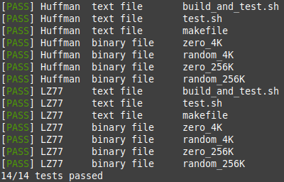

# Compressor
C++ file compression utility tool

## Implemented algorithms
- `huffman` - Canonical Huffman
- `lz77` - Lempel-Ziv 77

## Setup
Run `make build` to compile ./bin/compressor

## Usage
```
./bin/compressor -c|-d algorithm file1 file2
```

Options:
- `-c` - Compress the file1 using specified algorithm and save the result as file2
- `-d` - Decompress the file1 using specified algorithm and save the result as file2

## Tests
Run `./test.sh` to launch tests.
Run `./build_and_test.sh` to compile ./bin/compressor and launch tests.

Example test output:

